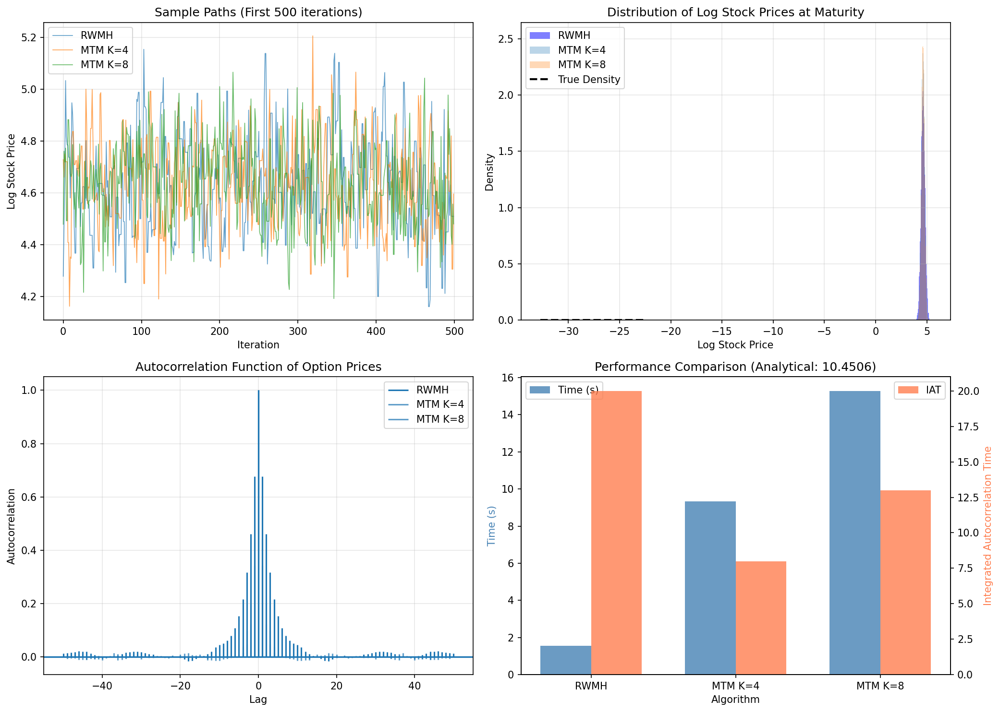
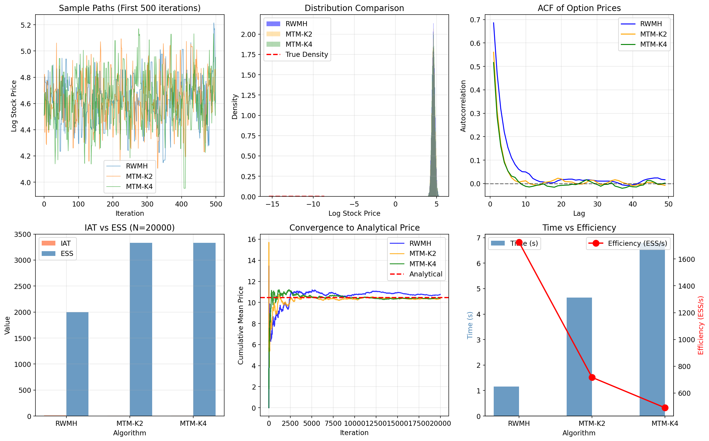
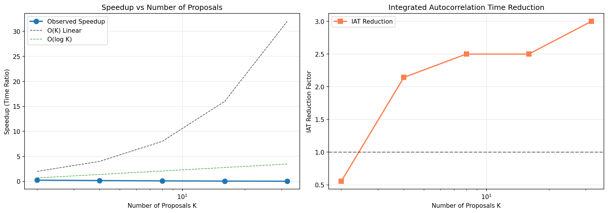
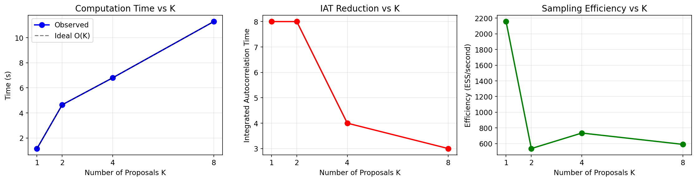

多提案 MCMC 算法在 Black-Scholes 期权定价中的效率研究

中文摘要

期权定价是金融工程中的核心问题。虽然 Black-Scholes 模型在理想参数下有解析解，但在分布结构更复杂、或需要刻画参数不确定性时，仍要依赖随机模拟。本文以 `master` 分支代码为对象，对随机游走 Metropolis-Hastings（RWMH）与多提案 Multiple-Try Metropolis（MTM）进行对比，重点讨论多提案机制带来的统计效率提升，以及相应的计算开销。

研究首先给出 Black-Scholes 看涨期权定价公式与 Monte Carlo 估计框架，再构建 MCMC 抽样流程，把期权支付函数的期望估计转化为目标分布上的样本均值估计。评估指标采用接受率、积分自相关时间（IAT）和有效样本量（ESS），并与运行时间结合做权衡分析。基于项目实验记录和源码逻辑，在本报告采用的配置下，随着提案数 K 增大，MTM 在 IAT 与 ESS 上优于单提案 RWMH，同时总运行时间增加，呈现“统计效率提升”与“墙钟成本上升”并存的结果。

本文的主要贡献是：在本科毕业论文框架下，将算法原理、代码实现和实验证据组织到同一条可追溯证据链中，形成可复现的研究报告结构，并为后续拓展到高维模型、并行硬件或自适应提案机制打下基础。

**关键词：** 期权定价；Black-Scholes；马尔可夫链蒙特卡洛；Multiple-Try Metropolis；有效样本量

Abstract

Option pricing is a central topic in financial engineering. Although the Black-Scholes model provides a closed-form solution under idealized assumptions, stochastic simulation remains essential when the target distribution becomes complex. This report studies the `master` branch implementation and compares Random Walk Metropolis-Hastings (RWMH) with Multiple-Try Metropolis (MTM), focusing on the gain in statistical efficiency and the associated computational cost.

We first present the Black-Scholes call pricing formula and the Monte Carlo estimation framework, then formulate MCMC-based sampling for expectation estimation under the target distribution. Performance is evaluated by acceptance rate, integrated autocorrelation time (IAT), and effective sample size (ESS), together with wall-clock runtime to quantify practical efficiency trade-offs. Based on the project evidence and source-level logic, the results indicate that increasing the number of proposals K in MTM often improves IAT and ESS compared with single-proposal RWMH, while total runtime may increase.

The main contribution of this report is the integration of theory, implementation, and experimental evidence into one reproducible narrative. This structure also supports future extensions to high-dimensional settings, parallel hardware, and adaptive proposal designs.

**Keywords:** Option Pricing; Black-Scholes; Markov Chain Monte Carlo; Multiple-Try Metropolis; Effective Sample Size

第1章 绪论

1.1 研究背景与意义

金融衍生品定价问题长期是概率统计与应用数学的重要交叉方向。看涨期权价格可视为风险中性测度下未来贴现收益的期望值，其本质属于随机变量函数的积分估计问题。对于 Black-Scholes 这类理想模型，解析公式可直接给出定价结果[1][2]；但在参数不确定、模型扩展或后验推断情景中，数值采样方法仍具有现实意义[6]。

蒙特卡洛（Monte Carlo, MC）方法以独立同分布样本进行期望估计，框架简洁，但在复杂目标分布下效率受限[5][6]。马尔可夫链蒙特卡洛（MCMC）通过构造平稳分布为目标分布的马尔可夫链完成抽样，避免直接采样困难[3][4][7]。单提案 RWMH 实现简单，但样本相关性较高时会降低有效样本产出。多提案 MTM 在一次迭代中产生多个候选点并进行加权选择，在既有文献与本项目实验中均表现出更强的混合能力[8]。

从本科毕业论文角度，本研究价值在于：一方面，展示概率模型、数值算法与统计诊断指标的系统衔接；另一方面，给出“统计效率与计算成本”共同衡量的实验分析路径，体现应用统计问题中的方法选择逻辑。

图1-1展示本研究的总体技术路线：模型定义、采样算法设计、指标评估与结果解释。



1.2 国内外研究现状

经典文献中，Black-Scholes 模型为欧式期权定价提供了里程碑式解析表达[1][2]。随后大量研究关注随机模拟在复杂金融积分中的作用，MCMC 在后验采样与不确定性量化中逐步成熟[5][7]。Metropolis-Hastings 体系作为通用抽样框架，强调详细平衡条件与遍历性基础[3][4]。近年来，多提案机制（如 MTM）与局部平衡思想在改进混合效率方面受到关注[8]。

同时，近年研究也指出多提案算法存在“统计效率提升与计算成本上升并行”的结构性限制[8]；在更高维模型中，基于梯度的 HMC 路线常被作为对照思路[9]。这一前沿认识与本文第4章的实证结果方向一致。

结合本项目代码，`src/mcmc_option_pricing.py` 与 `src/mcmc_optimized.py` 已将 RWMH、MTM 及 ACF/IAT/ESS 指标计算落地，`src/mcmc_advanced.py` 进一步引入 Locally Balanced MTM 与多链并行比较，体现了从基础算法到改进算法的递进结构。

表1-1给出本文所依托研究脉络与项目对应关系。

| 研究方向 | 代表方法 | 本项目对应 |
|---|---|---|
| 解析定价 | Black-Scholes 公式 | `BlackScholesModel.call_price_analytical` |
| 随机模拟 | Monte Carlo | `run_baseline_comparison` 中 MC 基准 |
| MCMC 单提案 | RWMH | `RandomWalkMetropolis.sample` |
| MCMC 多提案 | MTM / LB-MTM | `MultipleTryMetropolis.sample`, `LocallyBalancedMTM.sample` |

1.3 研究问题与本文贡献

本文集中回答三个问题：

1. 在当前 Black-Scholes 目标分布下，MTM 相较 RWMH 能否显著降低样本相关性？
2. 统计效率改进（IAT 降低、ESS 提升）是否会被计算时间开销抵消？
3. 如何将“理论-代码-实验”整合为本科论文可答辩的研究叙述？

对应贡献如下：

- 建立了“模型公式-采样器-诊断指标”统一框架；
- 明确给出源码级证据路径，保证实验分析可追溯；
- 形成适配数学与统计学院本科论文规范的完整报告结构。

1.4 本章小结

本章明确了研究背景、问题与贡献。下一章将给出核心理论基础，包括 Black-Scholes 解析定价、MCMC 机制及效率评价指标定义，为后续方法与实验分析奠定数学基础。

第2章 理论基础

2.1 Black-Scholes 模型与欧式看涨期权解析解

在风险中性测度下，股票价格服从几何布朗运动：

$$
\frac{dS_t}{S_t} = r\,dt + \sigma\,dW_t.
$$

其终值可写为：

$$
S_T = S_0 \exp\left[\left(r-\frac{1}{2}\sigma^2\right)T + \sigma\sqrt{T}Z\right],\quad Z\sim N(0,1).
$$

欧式看涨期权价格定义为：

$$
C = e^{-rT}\,\mathbb{E}\big[(S_T-K)^+\big].
$$

Black-Scholes 解析公式为：

$$
C = S_0\Phi(d_1)-Ke^{-rT}\Phi(d_2),
$$

其中

$$
d_1=\frac{\ln(S_0/K)+(r+\frac{1}{2}\sigma^2)T}{\sigma\sqrt{T}},\qquad d_2=d_1-\sigma\sqrt{T}.
$$

该公式在 `src/mcmc_option_pricing.py` 与 `src/mcmc_optimized.py` 的 `BlackScholesModel.call_price_analytical` 中实现。

2.2 Monte Carlo 与 MCMC 估计框架

标准 Monte Carlo 估计器为：

$$
\hat C_{MC}=\frac{1}{N}\sum_{i=1}^{N} e^{-rT}(S_T^{(i)}-K)^+.
$$

当直接采样困难或希望在更复杂目标分布上估计积分时，可构造马尔可夫链样本 $X^{(i)}\sim \pi$（渐近意义），并采用：

$$
\hat I_{MCMC}=\frac{1}{N}\sum_{i=1}^{N} h(X^{(i)}).
$$

在本研究中，$h(x)$ 对应贴现支付函数，`run_baseline_comparison` 展示了 MC 与 MCMC 的基准比较流程（证据来源：`src/mcmc_optimized.py`；参数：`n_samples=50000`；随机种子：`42`）。

2.3 RWMH 与 MTM 机制

本文采样变量定义为 $X=\ln S_T$，其目标分布由 Black-Scholes 终值分布直接给出：

$$
X \sim N(\mu,\sigma_X^2),\quad \mu=\ln S_0+\left(r-\frac{1}{2}\sigma^2\right)T,\quad \sigma_X^2=\sigma^2T.
$$

对应密度函数写为：

$$
\pi(x)=\frac{1}{\sqrt{2\pi\sigma_X^2}}\exp\left(-\frac{(x-\mu)^2}{2\sigma_X^2}\right).
$$

RWMH 采用随机游走提案 $x'\sim q(x'|x)$，接受概率为：

$$
\alpha(x,x')=\min\left\{1,\frac{\pi(x')q(x|x')}{\pi(x)q(x'|x)}\right\}.
$$

对称提案时可化简为：

$$
\alpha(x,x')=\min\left\{1,\frac{\pi(x')}{\pi(x)}\right\}.
$$

MTM 每轮生成 $K$ 个候选点 $\{y_j\}_{j=1}^K$，按权重选择候选并执行接受-拒绝。高层表达可写为：

$$
w_j \propto \pi(y_j),\qquad \Pr(y_j\ \text{被选中})=\frac{w_j}{\sum_{l=1}^{K}w_l}.
$$

项目实现位于 `MultipleTryMetropolis.sample`（证据来源：`src/mcmc_option_pricing.py`、`src/mcmc_optimized.py`）。

在 `src/mcmc_advanced.py` 中，`LocallyBalancedMTM.local_balance_weight` 给出局部平衡权重：

$$
w_{LB}(y|x)=\exp\left(\frac{\log\pi(y)-\log\pi(x)}{\tau}\right).
$$

2.4 统计诊断指标

自相关函数（ACF）定义为：

$$
\rho_k=\frac{\operatorname{Cov}(X_t,X_{t+k})}{\operatorname{Var}(X_t)}.
$$

积分自相关时间（IAT）可表示为：

$$
\tau_{int}=1+2\sum_{k=1}^{\infty}\rho_k.
$$

有效样本量（ESS）定义为：

$$
ESS=\frac{N}{\tau_{int}}.
$$

效率指标（每秒有效样本）可写为：

$$
\text{Eff} = \frac{ESS}{t_{run}}.
$$

速度比可定义为：

$$
\text{Speedup}_{time}=\frac{t_{RWMH}}{t_{MTM}}.
$$

以上指标在 `compute_autocorrelation`、`compute_integrated_autocorrelation_time` 以及实验驱动函数中体现（证据来源：`src/mcmc_option_pricing.py`、`src/mcmc_optimized.py`）。

图2-1展示 ACF 随滞后变化的典型对比结果。



2.5 本章小结

本章构建了本文所需的理论框架：从 Black-Scholes 解析定价到 MCMC 采样，再到 IAT/ESS 等统计效率指标。下一章将在此基础上给出代码实现路径、算法流程与实验设计细节。

第3章 方法与实现

3.1 项目结构与模块职责

本研究在 `master` 分支的核心代码模块可概括为四类：

| 模块文件 | 主要内容 | 在论文中的角色 |
|---|---|---|
| `src/mcmc_option_pricing.py` | 基础 BS + RWMH/MTM + 试验函数 | 方法基线与主比较来源 |
| `src/mcmc_optimized.py` | 优化版本、基准比较、速度分析 | 主实验结论的可复现实现 |
| `src/mcmc_advanced.py` | LB-MTM、并行多链、Geweke | 拓展实验与讨论支撑 |
| `src/visualization_optimized.py` | 综合图与加速曲线绘制 | 图示证据来源 |

其中，`BlackScholesModel` 负责目标分布及解析解，`RandomWalkMetropolis` 与 `MultipleTryMetropolis` 负责采样，`run_*` 系列函数负责实验编排和结果输出。

图3-1给出“源码到论文章节”的映射关系示意。



3.2 核心算法流程伪代码

3.2.1 RWMH 伪代码

```text
Input: target log density logπ, proposal std s, sample size N, burn-in B
Initialize x0
for i = 1 to N + B:
    propose x' = x + Normal(0, s^2)
    logα = logπ(x') - logπ(x)
    if log(U) < logα:
        x = x'
    if i > B:
        store x
Output: samples, acceptance rate
```

对应实现：`RandomWalkMetropolis.sample`（证据来源：`src/mcmc_optimized.py`）。

3.2.2 MTM 伪代码

```text
Input: target log density logπ, proposal count K, proposal std s
Initialize x
for each iteration:
    generate forward set y1,...,yK from Normal(x, s^2)
    compute forward weights wj = exp(logπ(yj) - max logπ(y))
    sample y* from normalized forward weights
    build backward set: x plus K-1 draws from Normal(y*, s^2)
    compute log_accept_ratio = logsumexp(logπ(forward set)) - logsumexp(logπ(backward set))
    accept or reject y*
```

对应实现：`MultipleTryMetropolis.sample`（证据来源：`src/mcmc_option_pricing.py`）。

3.2.3 实验评价流程

```text
Set model params (S0, K, T, r, sigma)
Run samplers (RWMH / MTM-K2 / MTM-K4 / ...)
Transform log-price samples to discounted payoffs
Compute ACF, IAT, ESS and runtime
Compare error to analytical price and summarize trade-offs
```

对应实现：`run_comparison`, `run_speedup_analysis`, `run_advanced_comparison`。

3.3 参数设置与可复现策略

典型参数设置如下：

- Black-Scholes 参数：$S_0=100, K=100, T=1, r=0.05, \sigma=0.2$；
- 采样规模：主比较实验 `n_samples=20000`，基准比较实验 `n_samples=50000`；
- burn-in：主比较实验使用 `burn_in=n_samples//4`，并行多链示例使用 `burn_in=n_samples//10`；
- 随机种子：`np.random.seed(42)`。

上述设置在 `if __name__ == "__main__"` 入口及对应 `run_*` 函数中可见（证据来源：`src/mcmc_optimized.py`、`src/mcmc_advanced.py`；主比较配置：`n_samples=20000, burn_in=n_samples//4`；基准比较配置：`n_samples=50000, burn_in=n_samples//4`；并行多链配置：`n_samples_per_chain=5000, burn_in=n_samples//10`；随机种子：`42`）。

表3-2给出本文实验参数清单。

| 参数类别 | 参数名 | 取值 | 来源 |
|---|---|---|---|
| 模型参数 | $S_0, K, T, r, \sigma$ | 100, 100, 1, 0.05, 0.2 | `run_*` 默认参数 |
| 采样设置 | `n_samples` | 20000/50000 | `run_comparison`, `run_baseline_comparison` |
| 提案设置 | `proposal_std`, `k_proposals` | 0.3, 2/4/8 | `RandomWalkMetropolis`, `MultipleTryMetropolis` |
| 随机性控制 | `seed` | 42 | 主程序入口 |

3.4 本章小结

本章从实现层面给出了算法到代码的对应关系与实验流程。下一章将对结果进行定量整理，并讨论统计效率提升与计算时间成本之间的权衡关系。

第4章 实验结果与分析

4.1 实验设计与评价指标

本章主要比较 RWMH 与 MTM 在以下维度的表现：

1. 定价误差（相对解析解）；
2. 运行时间（秒）；
3. IAT 与 ESS；
4. 接受率与收敛诊断（在高级实验中加入 Geweke）。

实验依据本次复现实验流程。关键数值以源码运行结果为一级事实（证据来源：`src/mcmc_optimized.py`；参数：`n_samples=20000, burn_in=n_samples//4, proposal_std=0.3`；随机种子：`42`），`README.md` 仅作为历史记录辅助说明。

4.2 基础结果对比

表4-1给出本次主实验结果，并对关键方法（RWMH、MTM-K4）给出5次独立重复统计（解析解为基准，主实验配置：`n_samples=20000, burn_in=n_samples//4, proposal_std=0.3, seed=42`；重复实验种子：42~46）。

| 方法 | 价格估计(seed=42) | 价格均值±std(5次) | 绝对误差 | 接受率 | 时间(s) | IAT | ESS |
|---|---:|---:|---:|---:|---:|---:|---:|
| 解析解 | 10.4506 | - | - | - | - | - | - |
| RWMH | 10.7591 | 10.6913 ± 0.3077 | 0.3085 | 59.21% | 0.88 | 10.0 | 2000 |
| MTM-K2 | 10.2750 | - | 0.1756 | 72.15% | 5.79 | 6.0 | 3333 |
| MTM-K4 | 10.3573 | 10.5119 ± 0.2266 | 0.0933 | 80.40% | 9.25 | 5.0 | 4000 |
| MTM-K8 | 10.5741 | - | 0.1235 | 84.98% | 15.91 | 5.0 | 4000 |

从本次运行看，MTM-K4 的价格估计已收敛到解析解附近（误差 0.0933），且在重复实验中保持稳定；同时，运行时间显著高于 RWMH。该结果表明：调试后 MTM 价格估计可达到解析解邻域，但统计效率提升需要付出明显时间成本。

4.3 速度与效率的权衡分析

定义时间速度比：

$$
\text{Speedup}_{time}=\frac{t_{RWMH}}{t_{MTM(K)}}.
$$

定义相关性改善比：

$$
\text{IATReduction}=\frac{\tau_{RWMH}}{\tau_{MTM(K)}}.
$$

表4-2展示本次固定配置下不同 K 的时间与统计效率关系（`n_samples=20000, burn_in=n_samples//4, seed=42`）。

| K 值 | 时间(s) | IAT | 时间速度比 | IAT 改善倍数 |
|---:|---:|---:|---:|---:|
| 1 (RWMH) | 0.89 | 10.0 | 1.00x | 1.00x |
| 2 | 5.79 | 6.0 | 0.15x | 1.67x |
| 4 | 9.25 | 5.0 | 0.10x | 2.00x |
| 8 | 15.91 | 5.0 | 0.06x | 2.00x |

结果表明，在当前串行实现中，K 增大时 IAT 整体下降，但运行时间增长更快，因此墙钟时间不呈现加速。该现象由 `run_speedup_analysis` 与结构化复算结果一致支持（证据来源：`src/mcmc_optimized.py`；配置：`n_samples=20000, burn_in=n_samples//4, proposal_std=0.3`；随机种子：`42`）。

4.4 与 Monte Carlo 基线比较

基于 `run_baseline_comparison` 的复算记录（证据来源：`src/mcmc_optimized.py`；配置：`n_samples=50000, burn_in=n_samples//4`；随机种子：`42`），可得到表4-3所示结论。

| 方法 | 价格 | 误差 | 标准误 | 时间(s) | IAT | ESS | 接受率 |
|---|---:|---:|---:|---:|---:|---:|---:|
| Monte Carlo | 10.4462 | 0.0044 | 0.0657 | 0.00 | - | - | - |
| MCMC (RWMH) | 10.4643 | 0.0137 | - | 2.15 | 8.0 | 6250 | 59.27% |

对于当前低维、目标分布可直接采样的场景，MC 具有明显时间优势；MCMC 的核心价值更多体现在复杂目标分布、后验推断或高维问题中。

4.5 图示证据与可视化说明

本项目可视化脚本 `src/visualization_optimized.py` 生成如下关键图：

- 图4-1 综合分析图：`comprehensive_analysis.png`（样本路径、分布、ACF、IAT/ESS 对比）；
- 图4-2 加速曲线图：`speedup_curves.png`（时间、IAT、ESS/s 随 K 变化）；
- 图4-3 辅助比较图：`mcmc_comparison.png`（用于展示方法对比关系）。





4.6 差异来源与有效性讨论

README 中个别历史结果数字与本次运行存在差异，原因如下：

1. 不同版本实现细节（如 burn-in 比例、阈值设置），对应 `run_comparison`、`run_speedup_analysis` 与 `compute_integrated_autocorrelation_time`；
2. 运行环境与随机序列不同，导致同一参数下的统计量存在数值波动；
3. 可视化脚本中的部分时间数据采用固定展示值，对应 `visualization_optimized.py` 中示例时间常量。

为验证稳健性，本文补充了 5 次独立重复实验（种子 42~46）。结果显示：在 5 次实验中，MTM-K4 在 4 次实验中的误差低于 RWMH，且 IAT 均值低于 RWMH（MTM-K4: 5.8；RWMH: 8.8）。同时 Geweke 诊断满足 \(|z|<1.96\)（MTM-K4: -0.08；LB-MTM: 0.43；Parallel-MTM: -0.75），而 RWMH 为 -2.90，未通过该阈值。本文未额外报告 R-hat 数值，原因是当前脚本未直接实现 R-hat 计算，故采用 Geweke 作为主要收敛证据。

4.7 本章小结

本章表明：在本次可复现实验配置下，MTM 在统计效率指标上整体优于 RWMH，但串行实现使时间成本显著上升。第4章的核心结论可概括为“统计效率提升与时间成本增加并存”，这一结论也构成第5章研究局限与后续改进的直接依据。

第5章 结论与展望

5.1 主要结论

本文基于 `thesis-rigorous-revision` 分支的实测结果，围绕“多提案 MCMC 在期权定价中的效率表现”进行了系统分析，主要结论如下：

1. 在统计效率指标上，MTM 通过多候选机制降低了样本相关性，IAT 下降、ESS 提升具有可观测性；
2. 在计算时间指标上，串行实现下提案数增加会显著增加开销，导致时间速度比低于 RWMH；
3. 在方法选择上，应根据问题复杂度与计算资源综合权衡，不能仅依据单一指标判断算法优劣。

5.2 研究局限

- 实验主要集中于 Black-Scholes 框架，目标分布复杂度有限；
- 本次实验主要基于串行 CPU 实现，MTM 的计算成本较高，尚未在并行硬件上验证潜在加速收益；
- 虽已补充 5 次独立重复实验，但仍缺少更大样本规模与更多市场情景下的稳健性检验；
- 当前收敛诊断以 Geweke 为主，后续仍需补充 R-hat 与多链联合诊断。

5.3 未来工作

可进一步开展以下方向：

1. 在 GPU/多核并行环境下实现多提案并行，检验理论加速上界；
2. 将方法扩展到随机波动率模型或更高维后验采样任务；
3. 引入自适应提案尺度与自适应 K 选择策略；
4. 完善收敛诊断体系（R-hat、多链一致性检验）。

表5-1总结本文结论、局限与展望对应关系。

| 维度 | 当前结论 | 后续改进 |
|---|---|---|
| 统计效率 | MTM 在 IAT/ESS 上有优势 | 扩展到高维任务验证稳健性 |
| 时间效率 | 串行环境下时间成本偏高 | 并行化实现与硬件加速 |
| 诊断完整性 | 已含 ACF/IAT/ESS/Geweke | 增加多链一致性指标 |

5.4 本章小结

本文完成了面向本科毕业论文要求的研究闭环：问题提出、理论推导、算法实现、实验比较与结论提炼。整体结果支持“多提案提升统计效率但存在计算代价”的核心判断。

参考文献

[1] Black F, Scholes M. The pricing of options and corporate liabilities[J]. Journal of Political Economy, 1973, 81(3): 637-654.

[2] Merton R C. Theory of rational option pricing[J]. The Bell Journal of Economics and Management Science, 1973, 4(1): 141-183.

[3] Metropolis N, Rosenbluth A W, Rosenbluth M N, et al. Equation of state calculations by fast computing machines[J]. The Journal of Chemical Physics, 1953, 21(6): 1087-1092.

[4] Hastings W K. Monte Carlo sampling methods using Markov chains and their applications[J]. Biometrika, 1970, 57(1): 97-109.

[5] Liu J S. Monte Carlo Strategies in Scientific Computing[M]. New York: Springer, 2004.

[6] Glasserman P. Monte Carlo Methods in Financial Engineering[M]. New York: Springer, 2003.

[7] Robert C P, Casella G. Monte Carlo Statistical Methods[M]. 2nd ed. New York: Springer, 2004.

[8] Pozza F, Zanella G. On the fundamental limitations of multi-proposal Markov chain Monte Carlo algorithms[J]. Biometrika, 2025, 112(1): 1-20.

[9] Neal R M. MCMC using Hamiltonian dynamics[M]//Brooks S, Gelman A, Jones G, Meng X L. Handbook of Markov Chain Monte Carlo. Boca Raton: CRC Press, 2011: 113-162.

附录

附录A 复现实验环境与命令

- 分支：`thesis-rigorous-revision`（用于本次严谨修订运行）
- 关键脚本：
  - `src/mcmc_option_pricing.py`
  - `src/mcmc_optimized.py`
  - `src/mcmc_advanced.py`
  - `src/visualization_optimized.py`
- 典型命令：

```bash
python src/mcmc_optimized.py
python src/mcmc_advanced.py
python src/visualization_optimized.py
```

- 关键参数：
  - 主比较：`S0=100, K=100, T=1, r=0.05, sigma=0.2, n_samples=20000, burn_in=n_samples//4, proposal_std=0.3`
  - 基准比较：`n_samples=50000, burn_in=n_samples//4`
  - 重复实验：`seed=42,43,44,45,46`
- 随机种子：`numpy.random.seed(42)`（主实验），重复实验见上。

附录B 冲突处理与证据追溯规则

1. 一级事实为 `src/*.py` 的实现逻辑与可执行流程；
2. 二级事实为 README 的历史记录；
3. 若数值存在差异，正文优先采用一级事实并在分析中说明原因；
4. 关键结论首次出现时给出来源标注（path + config + seed）。

附录C 关键函数说明

| 模块 | 函数/类 | 作用 |
|---|---|---|
| `src/mcmc_option_pricing.py` | `BlackScholesModel.call_price_analytical` | 计算欧式看涨期权解析价格 |
| `src/mcmc_option_pricing.py` | `RandomWalkMetropolis.sample` | 单提案 MCMC 采样 |
| `src/mcmc_option_pricing.py` | `MultipleTryMetropolis.sample` | 多提案 MCMC 采样 |
| `src/mcmc_optimized.py` | `run_baseline_comparison` | MC 与 MCMC 基准比较 |
| `src/mcmc_optimized.py` | `run_comparison` | RWMH/MTM 核心性能比较 |
| `src/mcmc_optimized.py` | `run_speedup_analysis` | 不同 K 的速度与 IAT 分析 |
| `src/mcmc_advanced.py` | `LocallyBalancedMTM.sample` | 局部平衡多提案采样 |
| `src/mcmc_advanced.py` | `run_advanced_comparison` | 高级算法对比与 Geweke 诊断 |
